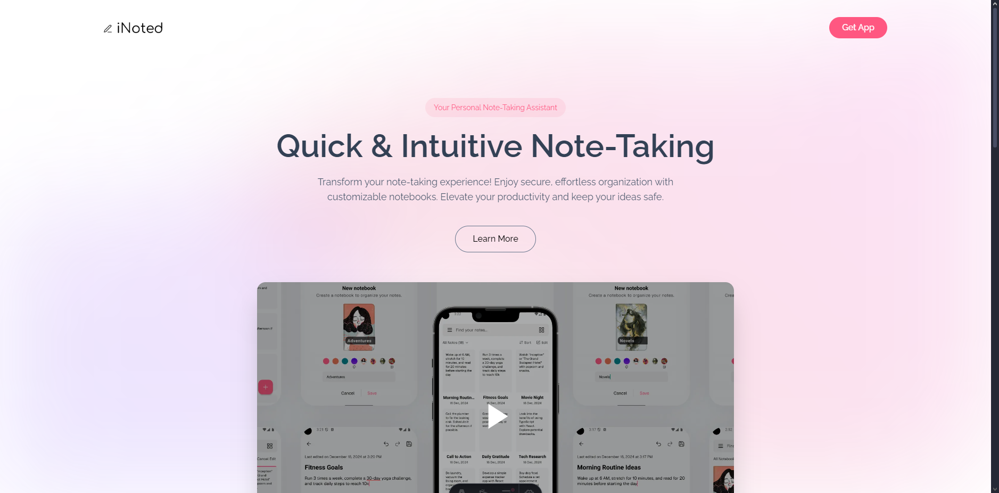

# **iNoted Website** - Discover Effortless Note-Taking



The **iNoted Website** serves as the official landing page for the **iNoted** mobile app, offering users a detailed overview of the app’s features, benefits, and functionality. It’s designed to provide quick access to information about the app and guide visitors on how to download it.

## **Technology Stack**

- Astro
- Tailwind CSS
- TypeScript

## **Getting Started**

1. **Clone the Repository**

   ```bash
   git clone https://github.com/yourusername/inoted-website.git
   cd inoted-site
   ```

2. **Install Dependencies**

   ```bash
   pnpm install
   ```

3. **Run the Development Server**

   ```bash
   pnpm dev
   ```

## **Contact**

For inquiries or support, please reach out at [alanbusinessnin@gmail.com](mailto:alanbusinessnin@gmail.com).
